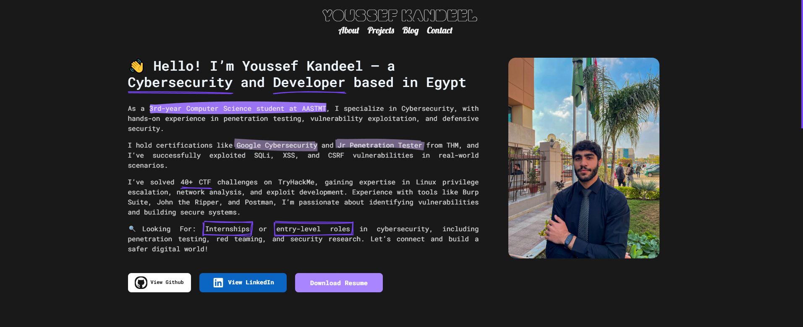

# Portfolio Website 🚀

[](https://www.python.org/)
[](https://www.python.org/)
[](https://www.python.org/)
[](https://www.python.org/)
[](https://www.python.org/)
[](LICENSE)

A modern developer portfolio website showcasing technical projects, blog posts, and professional experience. Built with pure HTML/CSS/JS and powered by Python automation scripts.



## Features ✨

- **Project Showcase**  
  - Featured/Recent project sections
  - Detailed project descriptions with tech stacks
  - GitHub links and implementation details

- **Dynamic Content Management**  
  - Python scripts for content updates
  - JSON-based data storage
  - Automated Git integration

- **Responsive Design**  
  - CSS Grid/Flexbox layouts
  - "Roboto Mono" typography

## Installation ⚙️

1. Clone repository:
```bash
git clone https://github.com/kandeel679/portfolio.git